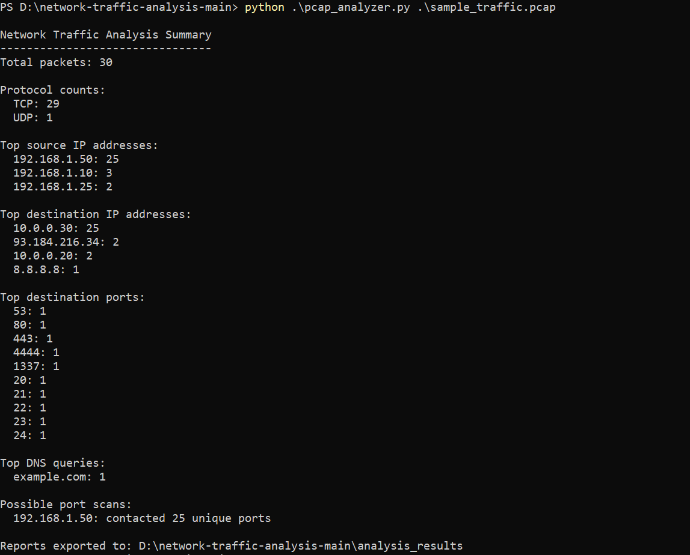

# Network Traffic Analysis

A Python cybersecurity project for analyzing PCAP network traffic, identifying suspicious connections, and documenting indicators of compromise.

## Planned Features

- Read `.pcap` and `.pcapng` files
- Count network protocols
- Identify top source and destination IP addresses
- Detect unusual destination ports
- Detect possible port-scanning activity
- Extract DNS queries
- Export findings to CSV
- Produce a summary report

## Technologies

- Python
- Scapy
- Wireshark-compatible PCAP files

## Disclaimer

This project is intended for educational, defensive, and authorized cybersecurity analysis only.

## Test Result

The analyzer was tested using a safely generated sample PCAP containing DNS traffic, normal web traffic, unusual destination ports, and simulated port-scanning activity.

The tool successfully detected a possible port scan from `192.168.1.50` contacting 25 unique destination ports.

